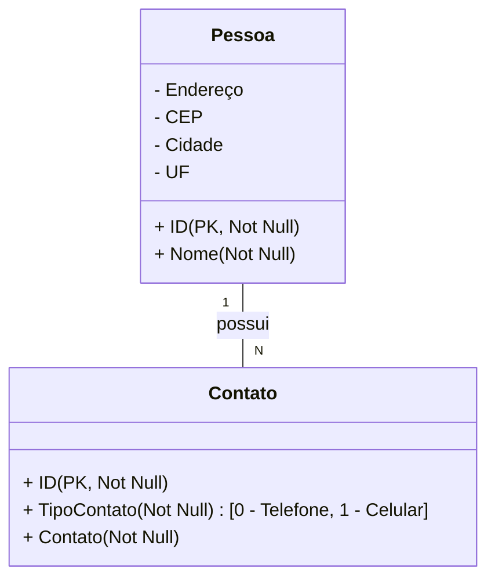

# Avaliação Java / Spring: API Rest para Controle de Contatos

Este projeto é uma API Rest para gerenciar cadastros de Pessoas e seus Contatos, permitindo operações CRUD na estrutura de Pessoas e Contatos1. Cada Pessoa pode ter vários Contatos.

```mermaid
classDiagram
  class Pessoa {
    + ID (PK, Not Null)
    + Nome (Not Null)
    - Endereço
    - CEP
    - Cidade
    - UF
  }

  class Contato {
    + ID (PK, Not Null)
    + TipoContato (Not Null) [0 - Telefone, 1 - Celular]
    + Contato (Not Null)
  }

  Pessoa "1" -- "N" Contato : possui
```

## 🛠️ Tecnologias Utilizadas 

Spring initializr (Project: Maven, Language: Java, Spring Boot: 3.0.12, Packaging: JAR, Java: 17, Dependencies: Spring Web e MySQL Driver)

- Java JDK 17;
- Maven 3.9.5;
- MySQL 8;
- Insominia 
- Docker

Adicionado as dependências spring-boot-starter-data-jpa, com.fasterxml.jackson.core e hibernate-validator. 

## 🔧 Instalação
1. Clone este repositório:
```
https://github.com/Wasselucasjp/Avaliacao-Minsait-Java-Spring
```

2. Compile o projeto usando o Maven:
```
mvn clean install
```

Execute a aplicação Spring Boot:
```
mvn spring-boot:run
```

## 📦 Implantação

Collection disponibilizada no arquivo:
```
MinsaitControleContato.postman_collection.json
```

Link para acessar documentação swagger:
```
http://localhost:8080/swagger-ui/index.html
```

## Agradecimentos

Agradecimento ao Professor Eduardo Henrique Marques Ferreira (https://github.com/eduardohen1) por ter ministrado a aula de Spring Boot!

## Apêndice

Coloque qualquer informação adicional aqui

